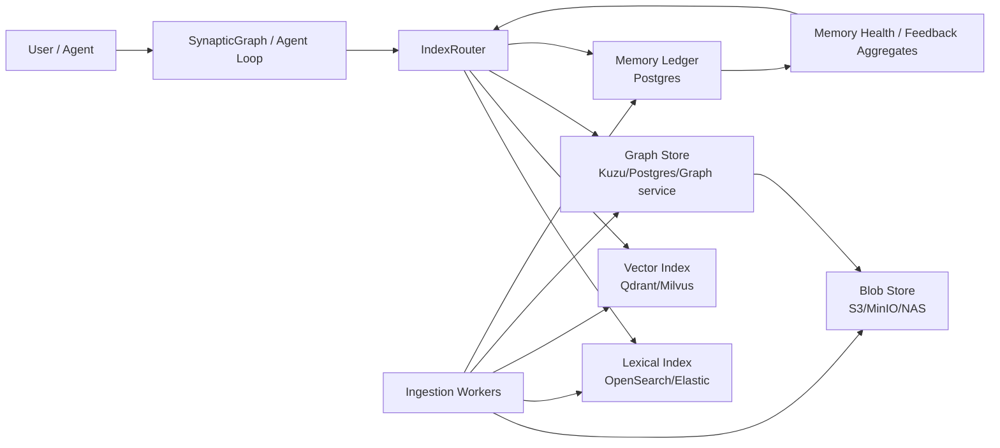

# Synaptic Memory v0.31 - 10TB Scale Operating Layer Plan

## Summary

This plan turns the current large-corpus retrieval work into a 10TB-class
document memory architecture. The current `main` already has the important
search intelligence:

- deterministic default search path
- `agent_search` / `deep_search` with bounded deterministic rewrites
- EvidenceSearch with FTS, optional vector seeds, graph expansion, rerank/MMR
- memory event ledger, retrieval feedback, scope-aware reinforcement, health
  reporting, and pollution signals
- CompositeBackend shape for Kuzu + Qdrant + MinIO

The part that is not yet 10TB-ready is the storage/index/ingestion operating
layer. A single SQLite/Kuzu-style backend can prove retrieval logic, but 10TB
requires specialized index services, incremental ingestion workers, ACL-aware
candidate routing, and health/lag observability.

## Current Evidence

Current public-scale assets:

- `tests/benchmark/data/msmarco_full.db`: 11GB SQLite DB
- `tests/benchmark/data/msmarco_passage_full.corpus.jsonl`: 8,841,823 passages
- DeepSeek 50-query baseline before recent rewrite work: `23/50`
- Post rewrite 50-query follow-up: `25/50`
- Current `main` scale-plan baseline: `31/50`
  (`examples/ablation/diagnostics/agent_loop_20260703_000851.md`)
- Targeted recovered cases:
  - `237373` soil/rocks process wording
  - `54544` blood-borne/sexually transmitted wording
  - `319564` carrot fiber serving-size wording
  - `155234` tire size/gas mileage wording
  - `208145` bicycle tube sizing wording

Current code strengths:

- `run_agent_loop()` supports multi-turn tool exploration, forced first tool,
  sufficiency gating, history compaction, and trace logging.
- `deep_search_tool()` runs bounded deterministic rewrites internally and merges
  rewrite evidence before returning to the LLM.
- `EvidenceSearch.search()` provides the core candidate flow: FTS seed, optional
  vector seed, graph expansion, rerank/MMR aggregation, diagnostics.
- `SynapticGraph.search(record=True)` can persist retrieval events and connect
  results to feedback and scope-aware score updates.
- `memory_health()` already exposes feedback outcomes, memory event counts,
  score scopes, suspect targets, signal kinds, and semantic extraction failures.

Current scale blockers:

- `KuzuBackend.search_fts()` currently fetches all nodes and scores in Python for
  IR parity. That is useful for tests and small/medium graphs, but not viable at
  10TB.
- `CompositeBackend.search_vector()` fetches nodes from graph storage one by one
  after Qdrant returns ids. At 10TB this needs batch fetch, payload filters, and
  shard-aware routing.
- The `StorageBackend` protocol has no native query object for ACL, tenant,
  source, time range, document type, index generation, cursor, or score metadata.
- Ingestion is library-local. 10TB needs durable queues, idempotent jobs,
  retry/dead-letter handling, parser/OCR/embedding/index stages, and index lag
  reporting.
- Agent tools currently accept broad query strings. At 10TB every tool call must
  carry scope/ACL/domain filters and budgeted routing constraints.

## Target Architecture

The core rule is: no single store owns everything.

- Blob/object store owns original files and large extracted text.
- Lexical index owns BM25/fielded filtering.
- Vector index owns ANN retrieval.
- Graph store owns node/edge topology and provenance links.
- Ledger store owns events, feedback, scope scores, health summaries, and lag.
- `IndexRouter` owns candidate fan-out, merge, score normalization, and
  fallback rules.

## Data Model Layers

### Document Object

The original document is immutable content addressed by:

- `document_id`
- `source_uri`
- `content_hash`
- `version`
- `workspace_id`
- `acl_policy_id`
- `mime_type`
- `created_at`
- `updated_at`

The blob store keeps raw files and large extracted text. Graph/search stores
only compact content, pointers, and metadata required for retrieval.

### Chunk / Section

Searchable unit:

- `chunk_id`
- `document_id`
- `section_path`
- `page`
- `offset_start`
- `offset_end`
- `text_preview`
- `content_ref`
- `embedding_ref`
- `language`
- `domain`
- `source`
- `acl_policy_id`

Chunk ids must be deterministic across re-ingest when the same text and section
path survive. This is required for feedback and memory scores to remain useful
after incremental updates.

### Memory Metadata

Current `MemoryEvent`, `RetrievalEvent`, `MemoryScope`, and `MemoryScore` stay
as the operating ledger. At scale they move to a durable partitioned store.

Partition keys:

- `workspace_id`
- `domain`
- time bucket
- event kind
- scope key

## Retrieval Flow

1. Normalize query and scope.
2. Resolve ACL/domain/source/time filters.
3. Generate bounded deterministic rewrites.
4. Route each query variant through `IndexRouter`.
5. Fetch lexical candidates with scores and index metadata.
6. Fetch vector candidates with payload filters.
7. Merge by normalized score, query variant, source diversity, and recency.
8. Fetch graph neighborhoods only for bounded candidate ids.
9. Apply memory boosts/penalties within scope.
10. Rerank and MMR aggregate.
11. Return compact evidence with provenance pointers.
12. If `record=True`, persist retrieval event and diagnostics.

Important invariant:

- LLM prompts never receive raw provenance/event rows.
- Prompts receive selected evidence plus compact source/title/chunk/page
  summaries.

## New Runtime Contracts

The current `StorageBackend` remains the compatibility layer. The 10TB path adds
optional protocols.

### CandidateProvider

Returns scored candidate ids without materializing full nodes.

Fields required per candidate:

- `node_id`
- `document_id`
- `score`
- `score_source`
- `rank`
- `query_variant`
- `metadata`
- `index_generation`

### IndexRouter

Coordinates multiple candidate providers:

- lexical provider
- vector provider
- graph provider
- memory provider

Responsibilities:

- apply scope/ACL filters before provider search
- fan out query variants
- normalize provider scores
- dedupe candidates by node/document
- enforce per-provider and global budgets
- expose diagnostics and index lag

### IngestionJobStore

Tracks durable indexing work:

- `job_id`
- `document_id`
- `version`
- `stage`
- `status`
- `attempt`
- `error`
- `created_at`
- `updated_at`

Stages:

- `discover`
- `parse`
- `ocr`
- `chunk`
- `embed`
- `lexical_index`
- `vector_index`
- `graph_index`
- `semantic_extract`
- `ledger_commit`

### IndexHealthBackend

Reports operational lag:

- documents discovered vs indexed
- chunks parsed vs embedded
- lexical generation
- vector generation
- graph generation
- failed jobs by stage/source/model
- average and p95 indexing latency

## 10TB Storage Choices

Recommended first production-like PoC:

- Blob: MinIO or S3
- Lexical: OpenSearch or Elastic
- Vector: Qdrant cluster
- Ledger/metadata: Postgres
- Graph:
  - Kuzu for embedded/single-workspace PoC
  - Postgres edge tables or graph service for multi-tenant production

Do not force Kuzu to be the global 10TB graph store before measuring write and
multi-reader limits. Keep Kuzu as an excellent local graph/PoC backend and add a
router-compatible graph provider for production.

## Implementation Order

### Phase 0 - Baseline Lock

Goal: know whether later scale changes preserve current quality.

- Re-run DeepSeek 50-query baseline on current `main`.
  - Current result: `31/50`, mean first relevant turn `1.16`, empty calls `6`,
    duplicate calls `0`.
- If stable, run 100-query follow-up next.
- Report reach, first relevant turn/call, tool calls, empty calls, latency,
  prompt/completion tokens, and recovered/regressed qids.
- Keep raw JSONL as diagnostic artifact only when small and useful; summarize in
  curated markdown.

### Phase 1 - Contract Scaffolding

Goal: make the scale boundary explicit without changing default behavior.

- Add optional `CandidateProvider`, `IndexRouter`, `IngestionJobStore`, and
  `IndexHealthBackend` protocols.
- Add small dataclasses for candidate request/result/diagnostics.
- Add unit tests that these types serialize and keep default code unaffected.
- Document how `EvidenceSearch` will consume router candidates in Phase 2.

### Phase 2 - Router Prototype

Goal: prove the new boundary on the existing SQLite full DB.

- Implement an in-process router wrapping the current `StorageBackend`.
- Make `EvidenceSearch` optionally accept a router.
- Ensure default path remains identical when router is absent.
- Add diagnostics for provider counts, score ranges, dedupe counts, and lag.

Current implementation status:

- `StorageCandidateProvider` wraps legacy `StorageBackend.search_fts()` and
  returns scored candidate ids.
- `InProcessIndexRouter` merges provider results, dedupes by best score, and
  reports provider diagnostics.
- `EvidenceSearch(index_router=...)` can use routed candidate ids for the seed
  stage and hydrate only those ids.
- `SynapticGraph(index_router=...)` wires the router into the public search
  facade while keeping the default path unchanged when omitted.

### Phase 3 - External Lexical Provider

Goal: remove the 10TB-incompatible FTS bottleneck.

- Add OpenSearch/Elastic provider behind `CandidateProvider`.
- Support filters: workspace, ACL, domain, source, date, doc type, language.
- Return scored ids only; fetch full nodes in batches from metadata/graph store.
- Add 100GB to 1TB PoC benchmark.

Current implementation status:

- `OpenSearchCandidateProvider` accepts an injected OpenSearch/Elasticsearch
  client without adding a mandatory runtime dependency.
- It converts `IndexFilter` into provider-side bool filters for workspace, ACL,
  document id, source, language, mime type, tags, time ranges, and property
  filters.
- It returns deduped `ScoredCandidate` ids with normalized lexical scores and
  compact metadata, leaving node hydration to `EvidenceSearch` / graph storage.

### Phase 4 - Vector Provider Upgrade

Goal: make vector retrieval payload-filtered and batch-friendly.

- Extend Qdrant helper to return scored candidates and payload metadata.
- Add payload filters matching lexical filters.
- Add batch graph/metadata hydration for vector results.
- Add shard/collection strategy by workspace/domain/language.

### Phase 5 - Ingestion Pipeline

Goal: make new/changed data manageable as memory, not bulk reloads.

- Add durable ingestion job schema.
- Add idempotent parse/chunk/embed/index stages.
- Record every document version change as `MemoryEvent`.
- Add delete/update tombstone flow.
- Add index lag and failed-stage health report.

### Phase 6 - Memory Health at Scale

Goal: keep feedback and pollution management useful with increasing data.

- Move high-volume event aggregation to summary tables.
- Partition memory/retrieval events by workspace/time.
- Compute repeated failure, stale, conflict, and source/model drift from changed
  windows instead of full scans.
- Feed high-confidence penalties back into `IndexRouter`.

### Phase 7 - Production Gates

Goal: prove it can run on real business documents.

- Build 500-query internal eval set.
- Include single-hop, multi-hop, temporal, ACL, synonym, table/form, and
  policy-conflict queries.
- Measure recall@k, answer groundedness, first relevant turn/call, latency,
  token cost, index lag, and failure recovery.

## Acceptance Criteria

The system is 10TB-ready only when all are true:

- 1TB PoC shows no quality regression against current baseline.
- Retrieval p95 is within the agreed SLA for filtered queries.
- Incremental update/delete does not require full reindex.
- ACL filters are enforced before candidate materialization.
- Event/feedback/provenance remain metadata, not prompt bloat.
- Health report exposes index lag, failed stages, scope score distribution, and
  suspect memory targets.
- Agent tools cannot bypass scope/ACL/domain filters.
- Rollback/replay restores index state from document version and event ledger.

## Near-Term TODO

1. Run DeepSeek 100-query follow-up against the `31/50` baseline.
2. Upgrade the Qdrant helper into a vector `CandidateProvider` with payload
   filters and scored candidate metadata.
3. Add index lag/ingestion job persistence to a durable backend.
4. Run a 100GB or 1TB corpus rehearsal before any 10TB ingestion work.
